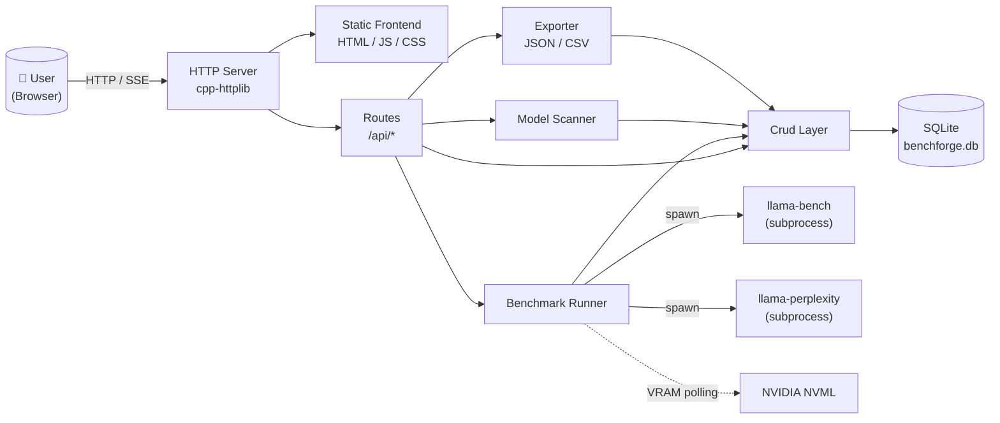
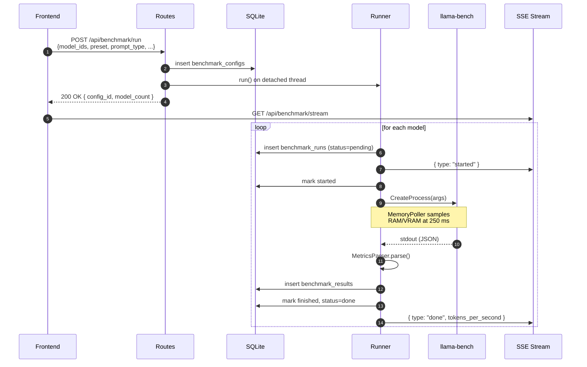
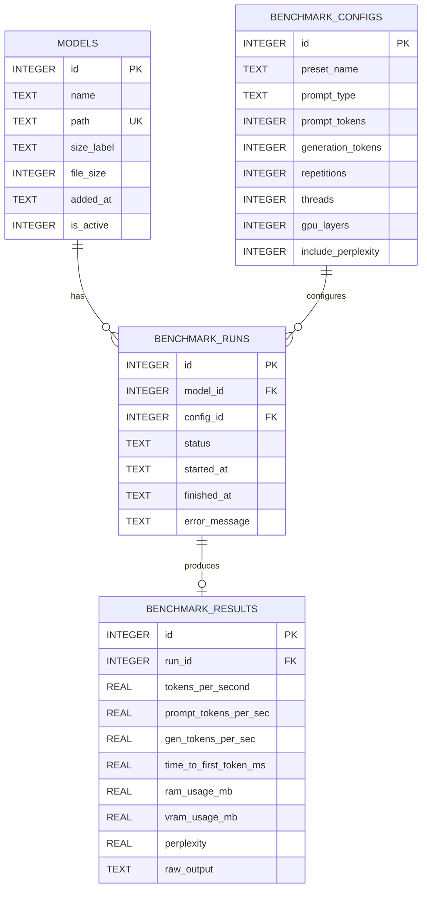

<div align="center">

# 🔨 BenchForge

**A self-hosted benchmarking workbench for local LLMs.**

Discover GGUF models on your machine, run reproducible benchmarks against `llama.cpp`, and compare throughput, latency, memory, and perplexity from a clean web dashboard.

[](LICENSE)
[](https://en.cppreference.com/w/cpp/17)
[](https://cmake.org/)
[](#-platform-support)
[](#-roadmap)

</div>

---

## 📖 Table of Contents

- [Overview](#-overview)
- [Key Features](#-key-features)
- [Architecture](#-architecture)
- [Tech Stack](#-tech-stack)
- [Repository Layout](#-repository-layout)
- [Getting Started](#-getting-started)
- [Configuration](#-configuration)
- [HTTP API Reference](#-http-api-reference)
- [Database Schema](#-database-schema)
- [Benchmarking Pipeline](#-benchmarking-pipeline)
- [Platform Support](#-platform-support)
- [Roadmap](#-roadmap)
- [Contributing](#-contributing)
- [License](#-license)
- [Acknowledgements](#-acknowledgements)

---

## 🎯 Overview

**BenchForge** is a local-first benchmarking dashboard for the `llama.cpp` ecosystem. It treats llama.cpp's official `llama-bench` and `llama-perplexity` binaries as a measurement substrate, then layers on:

- **Discovery** of GGUF models across configured directories
- **Persistent, reproducible runs** stored in SQLite with full configuration provenance
- **Live progress streaming** to the browser over Server-Sent Events
- **Cross-model comparison** with throughput, latency, memory, and quality metrics
- **One-click export** to JSON or CSV

The whole thing ships as a single C++ executable that serves a static frontend and a JSON API on `localhost`. No cloud, no telemetry, no daemon to manage.

> **Who this is for**
> Local LLM enthusiasts, ML engineers evaluating quantizations, and anyone tired of running `llama-bench` from the CLI and pasting numbers into spreadsheets.

---

## ✨ Key Features

### 🧩 Core
| | |
|---|---|
| 📂 **Auto-discovery** | Recursively scans configured directories for `.gguf` files; tracks moves and deletions across runs. |
| 🧪 **Reproducible benchmarks** | Every run captures the full `BenchmarkConfig` (preset, prompt size, threads, GPU layers) so results stay comparable. |
| 📊 **Rich metrics** | Generation t/s, prompt processing t/s, estimated TTFT, peak RAM, peak VRAM (NVML), and optional perplexity. |
| 🔁 **Repetition averaging** | Multi-rep runs are averaged at parse time to reduce noise. |
| 📡 **Live progress** | SSE stream of `started → progress → done/error` events for the active session. |
| 💾 **SQLite persistence** | WAL-mode database with FK enforcement; safe concurrent reads while a run is in flight. |
| 📤 **Export** | JSON (pretty) or CSV with proper field escaping, timestamped filenames. |

### 🖥 System awareness
| | |
|---|---|
| 🧠 **CPU** | Name and core count read from registry (Windows). |
| 🎮 **GPU** | Optional NVIDIA NVML integration for VRAM tracking; gracefully degrades to CPU-only mode when NVML isn't available. |
| 📈 **Background polling** | A 250 ms-cadence poller captures peak RAM/VRAM during each run on a dedicated thread. |

### 🛠 Developer experience
| | |
|---|---|
| ⚙️ **TOML config** | All knobs in one human-readable `config.toml`; sensible defaults baked in. |
| 🧷 **Single binary** | Frontend, config, and reference data are copied next to the executable on build. |
| 🔌 **CLI flags** | `--config`, `--port`, `--no-browser`, `--help`. |
| 🔒 **Graceful shutdown** | `SIGINT` / `SIGTERM` flip a flag and stop the HTTP server cleanly. |

---

## 🏛 Architecture

BenchForge is a layered C++ application: an HTTP/static-asset server on top, a benchmark orchestration core in the middle, and a SQLite persistence layer at the base. All long-lived services are stack-allocated in `main()` so destruction order is well-defined.

### High-level system diagram



### Benchmark request lifecycle



### Module responsibilities

| Module | Role |
|---|---|
| `config/` | Parses `config.toml` into a typed `Config` struct; provides `default_config()` fallback so the binary boots without a file. |
| `db/` | Owns the SQLite connection (WAL + FK on), defines schema, exposes `Crud` for typed queries against `models`, `benchmark_configs`, `benchmark_runs`, `benchmark_results`. |
| `discovery/` | `Scanner` walks `scan_dirs` recursively, registers new GGUFs, deactivates missing ones (preserves history). |
| `benchmark/` | `Runner` orchestrates per-model runs as subprocesses, captures stdout, parses JSON via `MetricsParser`, and wraps each run with `MemoryPoller`. `PerplexityRunner` does the same for `llama-perplexity` with regex parsing of the score line. |
| `utils/` | `SystemInfo` (CPU/GPU/RAM/VRAM snapshots) and `MemoryPoller` (background-thread peak-tracking). |
| `export/` | `Exporter` serializes `RunSummary` lists to JSON or CSV, with timestamped filenames in `exports/`. |
| `server/` | `Server` mounts static files; `Routes` mounts the JSON API + SSE stream and wires services together. |

---

## 🛠 Tech Stack

| Layer | Tool | Purpose |
|---|---|---|
| **Language** | C++17 | Core implementation |
| **Build** | CMake 3.20+ | Cross-platform build & dependency wiring |
| **HTTP** | [cpp-httplib](https://github.com/yhirose/cpp-httplib) | Header-only HTTP server with SSE support |
| **JSON** | [nlohmann/json](https://github.com/nlohmann/json) | Request/response serialization |
| **TOML** | [tomlplusplus](https://github.com/marzer/tomlplusplus) | Configuration parsing |
| **SQL** | [SQLiteCpp](https://github.com/SRombauts/SQLiteCpp) + SQLite | Embedded persistence |
| **GPU** | NVIDIA NVML *(optional)* | VRAM monitoring |
| **Backend dep** | [llama.cpp](https://github.com/ggerganov/llama.cpp) | `llama-bench` / `llama-perplexity` binaries |
| **Frontend** | Vanilla HTML / CSS / JS | Static, no framework, no build step |

> All C++ dependencies are vendored as **git submodules** under `third_party/`.

---

## 📁 Repository Layout

```
BenchForge/
├── CMakeLists.txt              # Build graph, submodule wiring, post-build copies
├── config.toml                 # Runtime configuration (port, scan dirs, presets)
├── LICENSE                     # Apache 2.0
│
├── src/
│   ├── main.cpp                # Entry point: CLI, signal handling, service wiring
│   │
│   ├── config/                 # TOML loader + typed Config struct
│   │   ├── config.hpp
│   │   └── config.cpp
│   │
│   ├── db/                     # SQLite schema + CRUD layer
│   │   ├── models.hpp          # Domain types (Model, BenchmarkRun, RunSummary, ...)
│   │   ├── database.hpp/.cpp   # Connection owner, schema bootstrap (WAL + FK)
│   │   └── crud.hpp/.cpp       # Typed queries, joins, summary views
│   │
│   ├── discovery/
│   │   └── scanner.hpp/.cpp    # Recursive .gguf scan, register/deactivate
│   │
│   ├── benchmark/
│   │   ├── runner.hpp/.cpp     # Subprocess orchestration, progress events
│   │   ├── metrics.hpp/.cpp    # llama-bench JSON parser, TTFT estimate
│   │   └── perplexity.hpp/.cpp # llama-perplexity wrapper with regex output parser
│   │
│   ├── export/
│   │   └── exporter.hpp/.cpp   # JSON / CSV serializers with proper escaping
│   │
│   ├── server/
│   │   ├── server.hpp/.cpp     # HTTP server bootstrap, static file mount
│   │   └── routes.hpp/.cpp     # All /api/* handlers + SSE broadcaster
│   │
│   └── utils/
│       └── system_info.hpp/.cpp # CPU/GPU/RAM/VRAM, MemoryPoller thread
│
├── frontend/                   # Static dashboard (served by the C++ binary)
│   ├── index.html
│   ├── css/style.css
│   └── js/{api,benchmark,charts,history,export,main}.js
│
├── third_party/                # Vendored deps (git submodules)
│   ├── cpp-httplib/
│   ├── nlohmann/
│   ├── tomlplusplus/
│   └── SQLiteCpp/
│
├── docs/                       # Architecture & contribution notes
├── reference/                  # Reference text files for perplexity (e.g. wiki.test.txt)
└── .github/workflows/          # CI / release pipelines
```

> ⚠️ Several files are intentionally placeholders during V1.1 backend development (frontend, docs, CI workflows). See [Roadmap](#-roadmap).

---

## 🚀 Getting Started

### Prerequisites

| Requirement | Minimum | Notes |
|---|---|---|
| **CMake** | 3.20 | Older versions lack the submodule conveniences used here. |
| **C++ compiler** | MSVC 2019+ / Clang 12+ / GCC 10+ | C++17 required. |
| **Git** | 2.13+ | Needed for submodule cloning. |
| **llama.cpp binaries** | Recent | `llama-bench.exe` and `llama-perplexity.exe` from a [llama.cpp](https://github.com/ggerganov/llama.cpp) build. |
| **NVIDIA driver + NVML** | *(optional)* | Required only for VRAM monitoring on NVIDIA GPUs. |

### 1. Clone with submodules

```bash
git clone --recurse-submodules https://github.com/AdityaGuhaa/BenchForge.git
cd BenchForge
```

If you already cloned without `--recurse-submodules`:

```bash
git submodule update --init --recursive
```

### 2. Configure & build

```bash
cmake -S . -B build
cmake --build build --config Release
```

The output binary lands in `build/bin/BenchForge.exe`, alongside `frontend/`, `config.toml`, and `reference/` (copied automatically by CMake post-build steps).

### 3. Provide llama.cpp binaries

Place `llama-bench.exe` and `llama-perplexity.exe` next to the executable, **or** edit `config.toml` and point `llama_bench_path` / `llama_perplexity_path` at your existing build.

### 4. Run

```bash
build\bin\BenchForge.exe
```

Then open <http://localhost:7860>. The browser opens automatically unless you pass `--no-browser`.

```
BenchForge -- local LLM benchmarking workbench

Usage: BenchForge [options]

Options:
  -c, --config <path>   Path to config.toml (default: ./config.toml)
  -p, --port <n>        Override server port from config
      --no-browser      Don't auto-open the browser on start
  -h, --help            Show this help and exit
```

---

## ⚙️ Configuration

Everything is driven by `config.toml`. Defaults are baked into `default_config()` so the binary still boots without a file.

<details>
<summary><strong>Sample <code>config.toml</code></strong></summary>

```toml
[general]
port                  = 7860
llama_bench_path      = "bin/llama-bench.exe"
llama_perplexity_path = "bin/llama-perplexity.exe"
db_path               = "data/benchforge.db"
open_browser          = true

[discovery]
scan_dirs      = ["C:/Users/you/models"]
recursive_scan = true

[benchmark]
default_preset = "quick"
threads        = 8
gpu_layers     = 99
repetitions    = 3

[presets.quick]
prompt_tokens     = 128
generation_tokens = 128
repetitions       = 1

[presets.thorough]
prompt_tokens     = 512
generation_tokens = 512
repetitions       = 5

[prompts.short_qa]
label             = "Short QA"
prompt_tokens     = 64
generation_tokens = 64

# ... medium_reasoning, long_programming, etc.

[perplexity]
reference_file = "reference/wiki.test.txt"

[export]
export_dir = "exports"
```
</details>

| Section | Purpose |
|---|---|
| `[general]` | Port, llama.cpp binary paths, SQLite path, browser auto-open. |
| `[discovery]` | Folders to scan and whether to recurse. |
| `[benchmark]` | Default thread count, GPU layer count, repetitions. |
| `[presets.*]` | Built-in `quick` and `thorough` presets. |
| `[prompts.*]` | Named prompt categories surfaced in the UI. |
| `[perplexity]` | Reference text used by `llama-perplexity`. |
| `[export]` | Output directory for JSON/CSV exports. |

---

## 🌐 HTTP API Reference

All endpoints live under `/api/` and exchange JSON. CORS is open (`*`) for local development.

### Models

| Method | Endpoint | Description |
|---|---|---|
| `GET`    | `/api/models`           | List all active models. |
| `POST`   | `/api/models/scan`      | Trigger a folder scan; returns `{new_models_found, models_deactivated, total_active_models, errors[]}`. |
| `POST`   | `/api/models/register`  | Manually register a model: `{ "path": "<absolute path to .gguf>" }`. |
| `DELETE` | `/api/models/{id}`      | Deactivate a model (history preserved). |

### Benchmark configuration & runs

| Method | Endpoint | Description |
|---|---|---|
| `GET`  | `/api/configs`            | Presets + prompt categories from `config.toml`. |
| `POST` | `/api/benchmark/run`      | Start a session: `{ model_ids[], preset_name, prompt_type, threads?, gpu_layers?, include_perplexity? }`. |
| `GET`  | `/api/benchmark/status`   | `{ "running": bool }`. |
| `POST` | `/api/benchmark/abort`    | Cooperative abort; the current model finishes. |
| `GET`  | `/api/benchmark/stream`   | **SSE** stream of `ProgressEvent` objects. |

#### `ProgressEvent` shape

```json
{
  "type": "started | progress | done | error",
  "run_id": 42,
  "model_id": 7,
  "model_name": "gemma-4b-it-q4_k_m",
  "current": 1,
  "total": 3,
  "message": "Running llama-bench...",
  "progress": 0.2
}
```

### Run history

| Method | Endpoint | Description |
|---|---|---|
| `GET`    | `/api/runs`        | All `RunSummary` rows, newest first. |
| `GET`    | `/api/runs/{id}`   | Single run summary. |
| `DELETE` | `/api/runs/{id}`   | Delete a run + result (model row preserved). |

### Export

| Method | Endpoint | Description |
|---|---|---|
| `POST` | `/api/export/json` | `{ "run_ids": [1, 2, 3] }` → file in `exports/`. |
| `POST` | `/api/export/csv`  | Same, CSV format. |

### System

| Method | Endpoint | Description |
|---|---|---|
| `GET` | `/api/system` | CPU name, core count, GPU name, RAM/VRAM totals & current usage. |

---

## 🗃 Database Schema

SQLite, opened in WAL mode with foreign keys enabled. Bootstrapped automatically on first launch.



**Design notes**
- `models.is_active` is a soft-delete flag — historical runs stay queryable when files are moved off disk.
- `benchmark_configs` is immutable per-run; every benchmark gets its own row so results remain reproducible even if defaults change later.
- `benchmark_results.raw_output` retains the full `llama-bench` JSON so metrics can be re-parsed without re-running.
- The `RunSummary` view is built via a `LEFT JOIN` so in-progress runs without a result row still surface in the UI.

---

## 🧪 Benchmarking Pipeline

### Metric extraction

`llama-bench` is invoked with `-o json` and produces one entry per `(prompt, gen, repetition)` tuple. `MetricsParser` averages across repetitions and exposes:

| Metric | Source | Unit |
|---|---|---|
| `tokens_per_second` | `avg_tg` (averaged) | tok/s |
| `prompt_tokens_per_sec` | `avg_pp` (averaged) | tok/s |
| `gen_tokens_per_sec` | same as `tokens_per_second` | tok/s |
| `time_to_first_token_ms` | `t_pp_ms / n_pp` (estimate) | ms |
| `ram_usage_mb` | `MemoryPoller` peak working set | MB |
| `vram_usage_mb` | NVML peak (if available) | MB |
| `perplexity` | regex over `llama-perplexity` stdout | dimensionless |

> ℹ️ **TTFT is an estimate.** True per-token timing requires instrumenting the model itself; `llama-bench` doesn't expose it, so BenchForge proxies it as average-time-per-prompt-token.

### Subprocess execution

The runner uses Win32 `CreateProcessA` with inherited stdout/stderr handles for synchronous capture, and falls back to `popen` on POSIX. Non-zero exit codes raise typed errors that are surfaced both in the `runs.error_message` column and via the SSE stream.

### Memory polling

`MemoryPoller` runs on a dedicated thread, sampling at 250 ms (configurable in code), tracking the peak observed values. It's started before the subprocess launch and joined before results are written, so writes only happen with finalized peaks.

---

## 💻 Platform Support

| Platform | Status | Notes |
|---|---|---|
| **Windows x64** | ✅ Primary target | Win32 subprocess + NVML lookup paths; `psapi` for working set; static MSVC runtime. |
| **Linux** | 🟡 Code paths present | POSIX fallbacks exist for subprocess execution and browser open; not yet exercised in CI. |
| **macOS** | 🟡 Code paths present | Same POSIX fallbacks; NVML unavailable. |

Build flags toggle:
- `BENCHFORGE_NVML_ENABLED` — set automatically by CMake when NVML is found, enables VRAM monitoring.

---

## 🗺 Roadmap

**Shipped (V1.1 — backend)**
- [x] Configuration loader with TOML + defaults
- [x] SQLite schema, CRUD, summary views
- [x] Recursive GGUF discovery with soft-delete
- [x] `llama-bench` subprocess runner with JSON parser
- [x] `llama-perplexity` runner with regex parser
- [x] System info + memory poller (NVML optional)
- [x] HTTP server, full `/api/*` surface, SSE progress stream
- [x] JSON / CSV exporter
- [x] CLI entry point with signal handling

**In progress**
- [ ] Frontend dashboard (`frontend/index.html`, JS modules)
- [ ] Architecture & contribution docs (`docs/`)
- [ ] CI workflow (`.github/workflows/ci.yml`)
- [ ] Release pipeline (`.github/workflows/release.yml`)

**Planned**
- [ ] Linux/macOS first-class support with CI matrix
- [ ] Charting + side-by-side model comparison view
- [ ] Run tagging / notes
- [ ] Optional auth for non-localhost deployments
- [ ] Pluggable backends beyond `llama.cpp`

---

## 🤝 Contributing

Contributions are welcome. The general flow:

1. **Fork** and create a feature branch off `main`: `feat/<short-name>` or `fix/<short-name>`.
2. **Build & verify** locally: `cmake --build build --config Release`.
3. **Keep commits focused.** Small, reviewable PRs land faster than mega-commits.
4. **Match the existing style** — file headers, ASCII section dividers, consistent naming inside `namespace benchforge`.
5. **Open a PR** with a brief description, screenshots if UI-related, and a note about manual testing performed.

Detailed contribution guidelines will land in `docs/contributing.md`.

---

## 📜 License

Distributed under the **Apache License 2.0**. See [`LICENSE`](LICENSE) for the full text.

```
Copyright 2025 Aditya Guha

Licensed under the Apache License, Version 2.0 (the "License");
you may not use this file except in compliance with the License.
```

---

## 🙏 Acknowledgements

BenchForge stands on the shoulders of excellent open-source projects:

- [**llama.cpp**](https://github.com/ggerganov/llama.cpp) — the inference engine being benchmarked
- [**cpp-httplib**](https://github.com/yhirose/cpp-httplib) — header-only HTTP/SSE
- [**nlohmann/json**](https://github.com/nlohmann/json) — JSON for modern C++
- [**tomlplusplus**](https://github.com/marzer/tomlplusplus) — TOML parsing
- [**SQLiteCpp**](https://github.com/SRombauts/SQLiteCpp) — clean SQLite C++ bindings

---

<div align="center">

**Maintainer:** [Aditya Guha](https://github.com/AdityaGuhaa)
Built for engineers who'd rather measure than guess.

</div>
